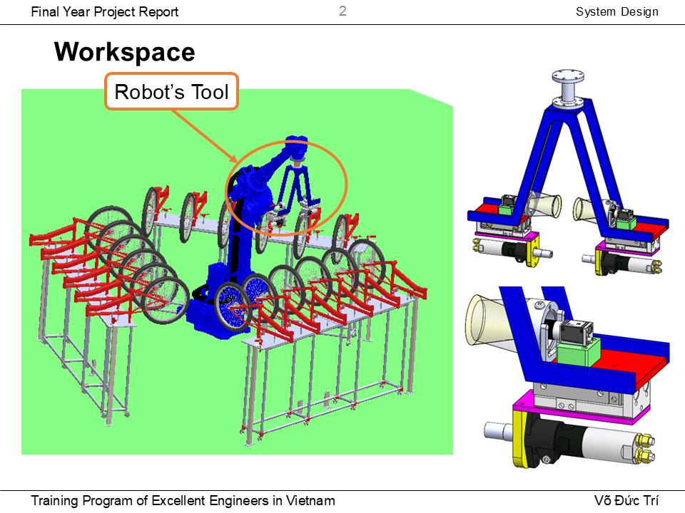
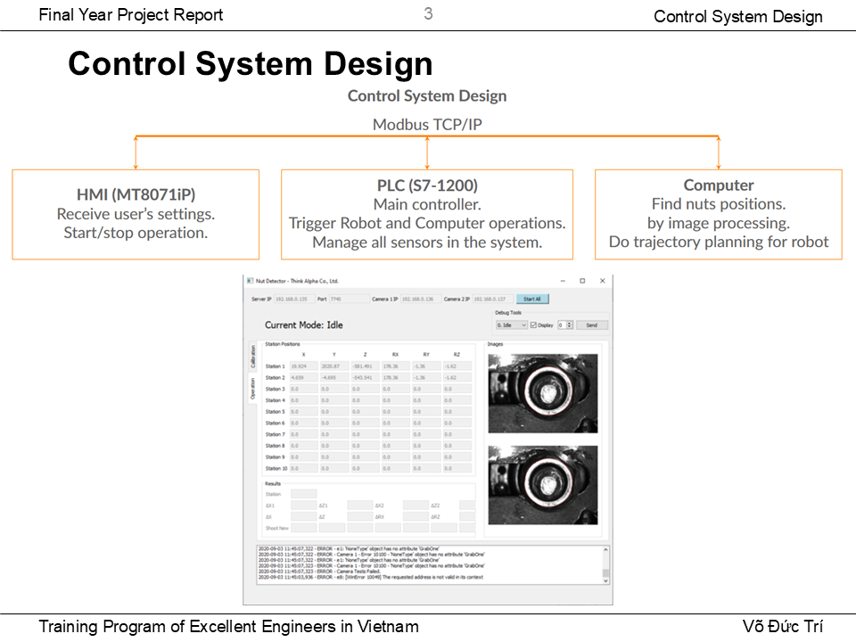
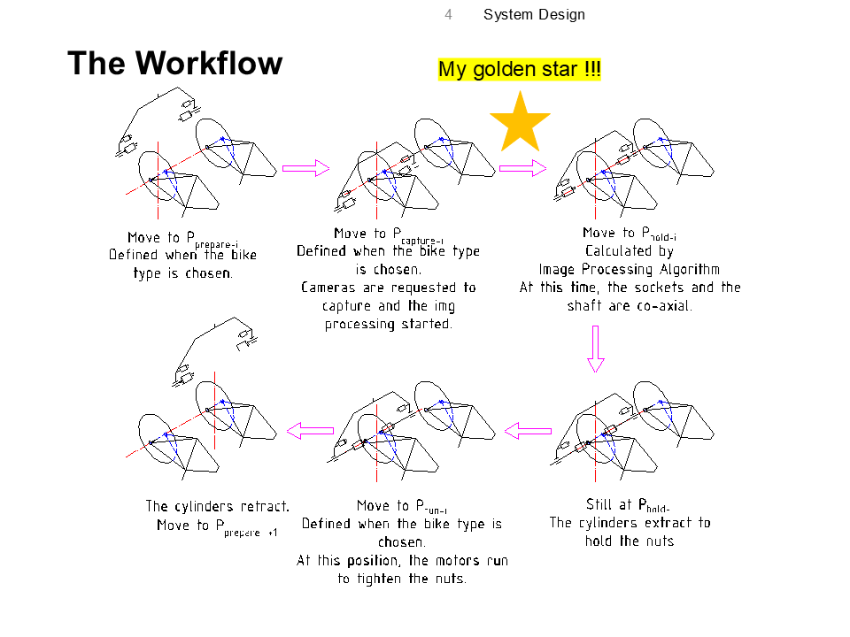
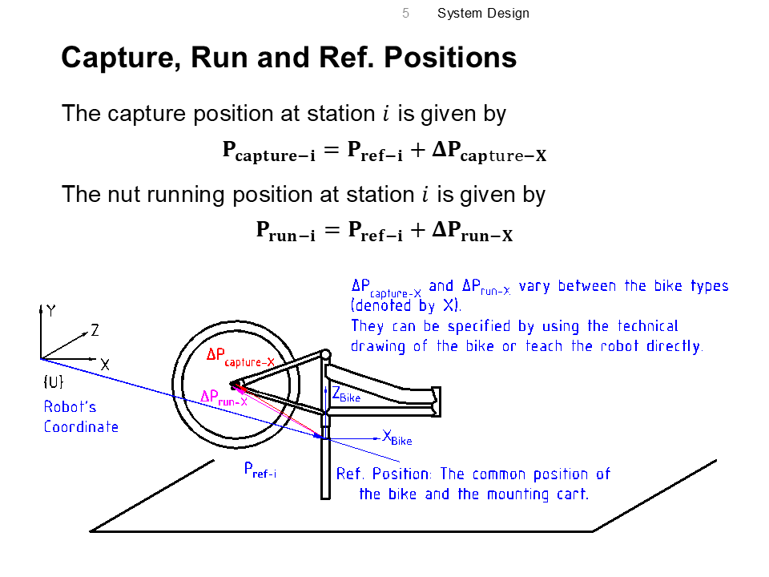
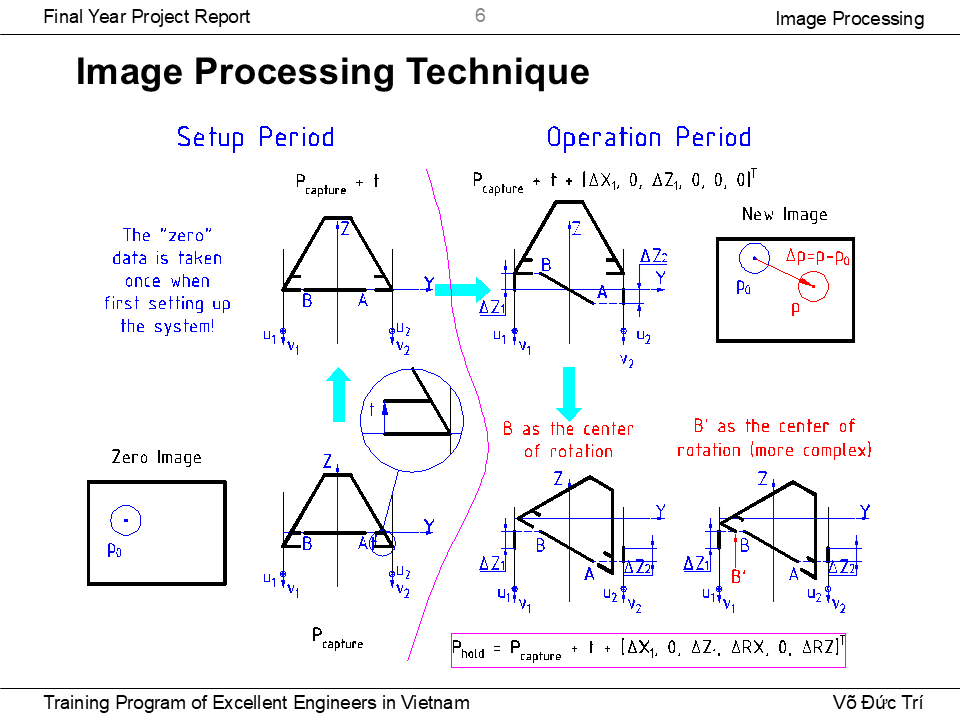
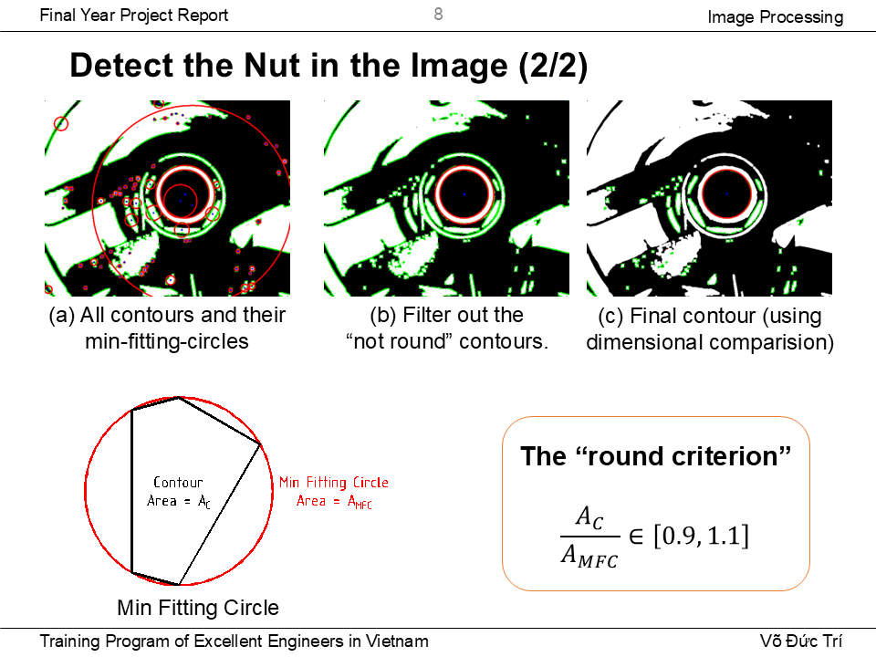

# Automated Nut Running System for Bicycles

My graduation project in Automation and Control (Mechatronics Engineering) in 2020. 
Programme de Formation d'Ingénieurs d'Excellence au Vietnam (PFIEV)
In collaboration with Autoss Ltd. (Vietnam) and ThinkAlpha Ltd. (Vietnam)

### System components:
- **PLC** (Siemens S7-1200): Main controller.  
- **HMI** (Weintek MT8071iP): User interface.  
- **Camera** (Basler 5M).  
- **Computer App**: GUI developed with Python, PyQt5, OpenCV, NumPy, Pylon.  
- **Communication Protocol**: RS232 (used for robot communication), Modbus, TCP/IP for PLC-Computer-HMI interaction.  
- **Robot Arm** (Yaskawa): Main actuator. The robot tool was designed in an A-shape, with nut runners on each side.  
- **Sensors and Mechanical Jigs**: For safety guarantee.

### Demo

### Presentation

